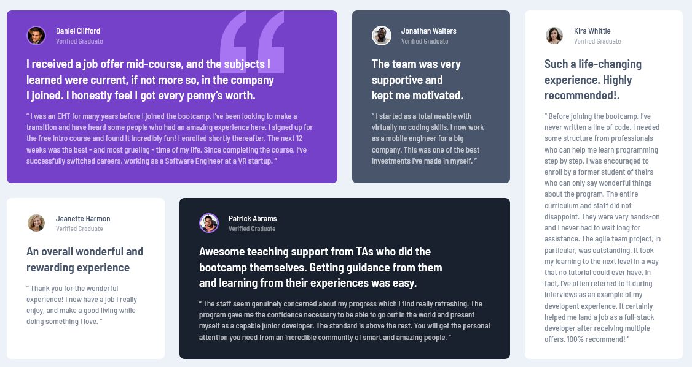

# Frontend Mentor - Testimonials grid section solution

This is a solution to the [Testimonials grid section challenge on Frontend Mentor](https://www.frontendmentor.io/challenges/testimonials-grid-section-Nnw6J7Un7). Frontend Mentor challenges help you improve your coding skills by building realistic projects. 

## Table of contents

- [Overview](#overview)
  - [The challenge](#the-challenge)
  - [Screenshot](#screenshot)
  - [Links](#links)
  - [Built with](#built-with)
  - [What I learned](#what-i-learned)
  - [Continued development](#continued-development)
  - [Useful resources](#useful-resources)
- [Author](#author)

## Overview

### The challenge

Users should be able to:

- View the optimal layout for the site depending on their device's screen size

### Screenshot

### Links

- Solution URL: [My solution](https://www.frontendmentor.io/solutions/testimonial-grid-section-with-css-grid-OdW4sa4F7D)
- Live Site URL: [Live preview](https://divadovitch.github.io/testimonials-grid-section-main/)

### Built with

- Semantic HTML5 markup
- CSS custom properties
- Flexbox
- CSS Grid
- Mobile-first workflow

### What I learned

To use a flexible grid for the layout on mobile with a `grid-template-columns: repeat(auto-fit, minmax(250px, 1fr));` and adapt its layout using a `grid-template-areas` with a media query. Use the `:nth-child()` pseudo-class to make the order of the cards count for the layout.

### Continued development

I would like to continue exploring the use of grids and their possibilities in flexible layouts.

### Useful resources

- [Autofit in CSS Grid](https://css-tricks.com/auto-sizing-columns-css-grid-auto-fill-vs-auto-fit/) - This helped me to make the CSS grid more flexible.

## Author

- Frontend Mentor - [Divadovitch](https://www.frontendmentor.io/profile/Divadovitch)
